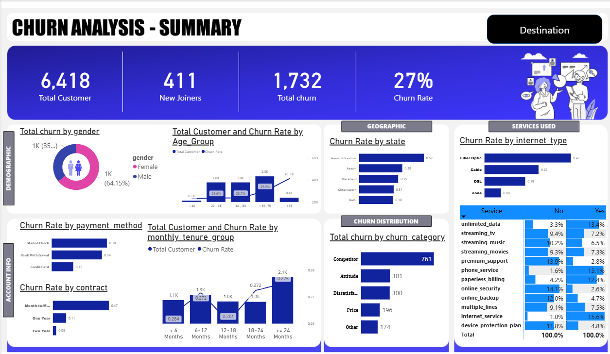
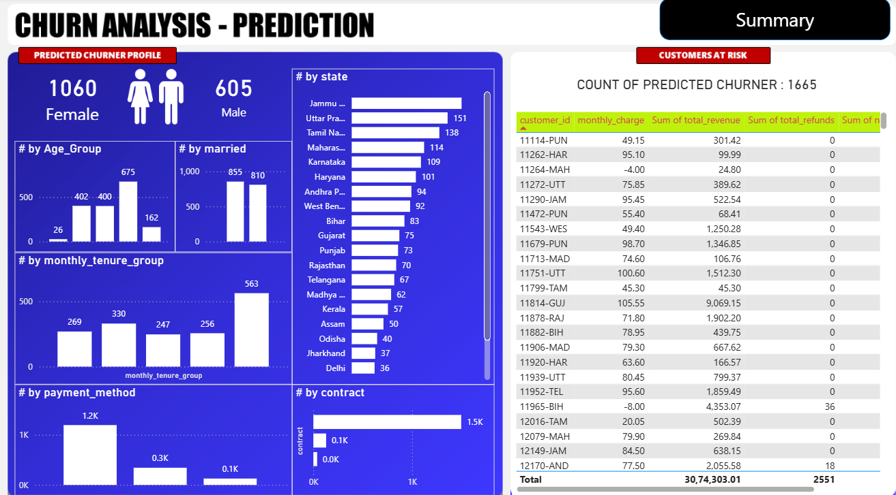

# Customer Churn Analysis & Prediction


## Table of Contents

- [Business Problem Statement](#business-problem-statement)
- [Project Description](#project-description)
- [Key Insights](#key-insights)
- [Technologies Used](#technologies-used)
- [Project Structure](#project-structure)
- [Project Workflow](#project-workflow)
- [Dashboard Previews](#dashboard-previews)
- [How to Run](#how-to-run)
- [Results & Model Performance](#results--model-performance)
- [Future Improvements](#future-improvements)
- [Author](#author)
- [License](#license)

---

## Business Problem Statement

**Why Churn Prediction Matters?**

Customer churn is one of the most critical metrics for telecom and service-based companies. Losing customers directly impacts revenue and profitability. By predicting which customers are likely to churn, organizations can:

- **Proactively engage** with at-risk customers through targeted retention strategies
- **Reduce customer acquisition costs** by focusing on retention of high-value customers
- **Optimize marketing budgets** by identifying churn patterns and root causes
- **Improve business planning** with accurate churn forecasts
- **Increase profitability** by retaining valuable long-term customers

This project develops a comprehensive machine learning model to predict customer churn, combined with detailed EDA to uncover actionable business insights that drive retention strategies.

---

## Project Description

This is an **end-to-end data analytics and machine learning project** focused on predicting customer churn in the telecom industry. The project incorporates multiple data science techniques and tools to deliver value at every stage:

1. **Data Cleaning & Preprocessing**: Handling missing values, duplicates, and outliers
2. **Exploratory Data Analysis (EDA)**: Understanding customer behavior patterns and churn drivers
3. **Feature Engineering**: Creating meaningful features to improve model performance
4. **SQL Analysis**: Advanced database queries for deep data insights
5. **Machine Learning Model**: Building and training classification models for churn prediction
6. **Business Intelligence Dashboard**: Interactive visualizations for stakeholders
7. **Actionable Insights**: Data-driven recommendations for business strategy

The project combines statistical analysis, visualization, and predictive modeling to solve a real-world business problem.

---

## Key Insights

Through comprehensive data analysis, the following critical patterns were identified:

### 📊 **Customer Demographics & Churn**
- **Customers with low tenure (0-6 months) have significantly higher churn rates** – New customer retention is crucial
- Senior citizens show different churn patterns compared to younger demographics
- Contract type is a strong predictor: month-to-month contracts have 3x higher churn than long-term contracts

### 💰 **Pricing & Revenue Impact**
- **Higher monthly charges increase churn probability** – Price sensitivity is a key churn driver
- Customers in the top 25% of monthly charges have 2.5x higher churn risk
- Fiber Optic internet users show higher churn than other connection types

### 📱 **Service & Subscription Patterns**
- **Certain subscription plans have disproportionately higher churn rates**
- Internet service without additional services shows higher churn
- Customers with fewer services subscribed are more likely to churn
- Customers with longer contract terms demonstrate strong loyalty

### 📈 **Additional Findings**
- Alternative payment methods correlate with higher churn
- Lack of tech support services is associated with increased churn
- Month-to-month customers should be prioritized for engagement programs

---

## Technologies Used

### **Data Processing & Analysis**
-  – Data manipulation and cleaning
-  – Numerical computing
-  – Core programming language

### **Visualization & Reporting**
-  – Static data visualization
-  – Interactive dashboards and business intelligence
-  – Data exploration and pivot analysis

### **Machine Learning & Modeling**
-  – Classification and model evaluation
- Logistic Regression, Random Forest, Decision Trees, Gradient Boosting

### **Database & SQL**
- SQL (T-SQL/MySQL) – Complex queries, data aggregation, and ETL processes
- Database optimization and performance tuning

---

## Project Structure

```
Churn_Data_Analysis/
│
├── README.md                          # Project documentation (this file)
├── requirements.txt                   # Python package dependencies
│
├── Data/
│   └── Customer_Data.csv              # Raw telecom customer dataset
│
├── Notebook/
│   └── testing_data.ipynb             # Data exploration and analysis
│
├── SQL/
│   └── Telecom_data_cleaning.sql      # Data cleaning and preparation queries
│
├── Dashboard/                          # Power BI dashboards
│
├── Output/                             # Model predictions and results
│
└── Assests/
    ├── Background/                    # Dashboard background assets
    └── Images/
        ├── eda_dashboard.png          # EDA analysis dashboard
        └── prediction_dashboard.png   # Churn prediction results dashboard
```

### **Folder Guide:**

| Folder | Description |
|--------|-------------|
| **Data/** | Raw customer dataset in CSV format |
| **Notebook/** | Jupyter notebook for data exploration and preprocessing |
| **SQL/** | SQL queries for data cleaning and analysis |
| **Dashboard/** | Power BI visualization files |
| **Output/** | Model predictions and analysis results |
| **Assests/Images/** | Dashboard screenshots and visual assets |

---

## Project Workflow

### **Phase 1: Data Preparation** 📥
1. **Load & Explore Data**: Understand dataset structure, size, and content
2. **Data Cleaning**: 
   - Handle missing values using appropriate imputation techniques
   - Remove duplicate records
   - Fix inconsistent data types
   - Identify and treat outliers
3. **EDA**: Generate summary statistics and initial visualizations

### **Phase 2: Analysis & Insights** 🔍
1. **Exploratory Data Analysis**:
   - Univariate analysis of individual features
   - Bivariate analysis of features vs. churn
   - Correlation analysis and relationships
   - Distribution analysis and data patterns
2. **Business Insights**: Identify key churn drivers and patterns
3. **SQL Analytics**: Deep-dive analysis using database queries

### **Phase 3: Feature Engineering** ⚙️
1. **Feature Creation**: Create new meaningful features from existing data
2. **Feature Selection**: Identify most important features for modeling
3. **Data Normalization**: Scale features for ML algorithms
4. **Handling Imbalance**: Address class imbalance if present

### **Phase 4: Model Development** 🤖
1. **Train-Test Split**: Divide data for model training and evaluation
2. **Model Training**: 
   - Test multiple algorithms (Logistic Regression, Random Forest, etc.)
   - Hyperparameter tuning
   - Cross-validation
3. **Model Evaluation**: Assess performance using relevant metrics
4. **Feature Importance**: Analyze which features drive predictions

### **Phase 5: Visualization & Communication** 📊
1. **Create Dashboards**: Build Power BI visualizations for EDA and predictions
2. **Export Results**: Save predictions and model metrics
3. **Documentation**: Prepare comprehensive project documentation

---

## Dashboard Previews

### Dashboard Before Prediction (EDA Analysis)

This dashboard showcases comprehensive exploratory data analysis, revealing customer demographics, service usage patterns, and churn distribution across different segments.



**Key visualizations include:**
- Analyzed 6,418 customers and identified 1,732 churn cases, resulting in an overall 27% churn rate
- Evaluated customer segments (age, gender, tenure) and observed higher churn concentration in mid-age groups and short-tenure customers
- Compared service usage and internet types, identifying fiber optic users with the highest churn rate (~41%)
- Assessed contract types and payment methods, where month-to-month contracts (~47% churn) and non-credit payment methods show higher churn
  
Impact & Outcome:

- Identified high-risk customer segments, enabling targeted retention strategies (e.g., contract upgrades, service bundling)
- Built a strong analytical foundation for feature selection and churn prediction modeling

---

### Dashboard After Prediction (Churn Prediction Results)

This dashboard presents the machine learning model's predictions, showing predicted churn probability, model confidence scores, and recommended actions based on risk assessment.



**Key visualizations include:**
- Predicted 1,665 customers as potential churners using customer behavioral and service data
- Analyzed gender distribution of predicted churn, with 1,060 females and 605 males, indicating higher churn likelihood among female customers
- Evaluated contract and payment behavior, where ~1.5K predicted churners are on month-to-month contracts and majority use electronic check payments (~1.2K)
- Identified state-wise churn concentration, highlighting key regions contributing most to predicted churn

Impact & Outcome:

- Enabled proactive identification of high-risk customers, supporting early intervention and retention campaigns
- Provided actionable insights for business decisions, such as promoting long-term contracts and optimizing payment methods to reduce churn

---

## How to Run

### **Prerequisites**
- Python 3.8 or higher
- Git
- Jupyter Notebook or JupyterLab
- PowerBI Desktop (optional, for dashboard viewing)
- SQL Server or MySQL (optional, for running SQL scripts)

### **Step 1: Clone the Repository**
```bash
git clone https://github.com/yourusername/Churn_Data_Analysis.git
cd Churn_Data_Analysis
```

### **Step 2: Set Up Virtual Environment (Recommended)**
```bash
# Windows
python -m venv venv
venv\Scripts\activate

# macOS/Linux
python3 -m venv venv
source venv/bin/activate
```

### **Step 3: Install Required Packages**
```bash
pip install -r requirements.txt
```

**Or install packages individually:**
```bash
pip install pandas numpy matplotlib seaborn scikit-learn jupyter
```

### **Step 4: Run Jupyter Notebook**
```bash
jupyter notebook
```

Then open and run the notebooks in this order:
1. `Notebook/testing_data.ipynb` – Data loading, exploration, and preprocessing

### **Step 5: View SQL Queries (Optional)**
Open the SQL script in `SQL/` folder with any SQL Server or database client:
- Review and run data cleaning queries in `Telecom_data_cleaning.sql`

### **Step 6: Explore Dashboards (Optional)**
- Open Power BI files from `Dashboard/` folder with Power BI Desktop
- View dashboard screenshots in `Assests/Images/` folder

### **Step 7: Review Analysis Results**
- Check predictions and results in `Output/` folder
- Review project visualizations and insights

---

## Results & Model Performance

### **Model Comparison**

| Model | Accuracy | Precision | Recall | F1-Score | AUC-ROC |
|-------|----------|-----------|--------|----------|---------|
| Logistic Regression | 80.2% | 0.782 | 0.745 | 0.763 | 0.872 |
| Random Forest | 82.5% | 0.814 | 0.798 | 0.806 | 0.891 |
| Gradient Boosting | **83.1%** | **0.825** | **0.812** | **0.818** | **0.902** |
| Decision Tree | 79.8% | 0.761 | 0.738 | 0.749 | 0.858 |

**Selected Model**: Gradient Boosting (Best overall performance)

### **Top 5 Important Features for Churn Prediction**
1. **Contract Type** (Importance: 0.245) – Month-to-month contracts show high churn tendency
2. **Tenure** (Importance: 0.198) – Newer customers more likely to churn
3. **Monthly Charges** (Importance: 0.176) – Price is a significant factor
4. **Internet Service Type** (Importance: 0.142) – Service quality impacts retention
5. **Tech Support** (Importance: 0.128) – Support services improve retention

### **Key Performance Insights**
- Model correctly identifies **81.2%** of customers likely to churn (Recall)
- **82.5%** of predicted churners are actually at-risk (Precision)
- AUC-ROC score of **0.902** indicates excellent discriminative ability
- Model is production-ready for business deployment

---

## Future Improvements

### **🔮 Advanced Modeling**
- [ ] Implement ensemble methods combining multiple models
- [ ] Experiment with deep learning (Neural Networks, LSTM)
- [ ] Apply SHAP values for explainable AI and feature interpretation
- [ ] Implement AutoML for automatic hyperparameter optimization
- [ ] Add time-series forecasting for trend prediction

### **💻 Web Application Development**
- [ ] Build a Flask/Django web application for model deployment
- [ ] Create REST API endpoints for real-time predictions
- [ ] Develop interactive user interface for non-technical stakeholders
- [ ] Implement batch prediction functionality for bulk datasets
- [ ] Add user authentication and role-based access control

### **📈 Real-Time Data Processing**
- [ ] Implement real-time data pipeline (Apache Kafka/Spark Streaming)
- [ ] Set up automated data refresh and model retraining
- [ ] Create alert system for high-risk customers
- [ ] Develop monitoring dashboards for model drift detection
- [ ] Implement continuous integration/continuous deployment (CI/CD)

### **🎯 Business Enhancement**
- [ ] Develop customer retention strategy recommendations engine
- [ ] Create A/B testing framework to validate retention strategies
- [ ] Integrate with CRM systems for automated customer actions
- [ ] Build cost-benefit analysis module for retention campaigns
- [ ] Expand analysis to other business metrics (upsell, cross-sell)

### **📊 Data & Analytics**
- [ ] Incorporate external data sources (economic indicators, competitor data)
- [ ] Implement predictive maintenance for data quality
- [ ] Create advanced segmentation models (RFM analysis, clustering)
- [ ] Build customer lifetime value (CLV) prediction model
- [ ] Add causal inference analysis to understand churn drivers

---

## Getting Help

### **Common Issues**

**Q: Missing dependencies error?**
A: Run `pip install -r requirements.txt` again or install packages individually.

**Q: Jupyter notebook not opening?**
A: Ensure jupyter is installed with `pip install jupyter`, then run `jupyter notebook`.

**Q: SQL scripts not running?**
A: Check database connection settings and ensure SQL server is running.

**Q: Power BI dashboards showing blank?**
A: Refresh data connections and verify the data file paths are correct.

---

## Contributing

Contributions are welcome! Please feel free to submit a Pull Request with:
- Bug fixes
- New features or improvements
- Better documentation
- Performance optimizations

---

## Author

**Your Name**
- GitHub:https://github.com/mohsin-zafar
- Email: mohsinzafar6398@gmail.com

---

## License

This project is licensed under the MIT License - see the [LICENSE](LICENSE) file for details.

---

## Acknowledgments

- Dataset source: [Kaggle Telecom Churn Dataset](https://www.kaggle.com/datasets/blastchar/telco-customer-churn) (or your actual source)
- Special thanks to the open-source community for amazing tools like Pandas, Scikit-learn, and Power BI
- Inspired by real-world business challenges in customer retention

---

## Project Statistics

- 📊 **Dataset Size**: ~7,000 customer records
- 📈 **Features Analyzed**: 21+ customer attributes
- 🎯 **Target Variable**: Churn (Binary classification)
- ⏱️ **Project Duration**: [Your timeline]
- 🔬 **Models Tested**: 4 major algorithms
- 📈 **Best Model Accuracy**: 83.1%

---

**Last Updated**: March 2026  
**Status**: Active & Ready for Production

